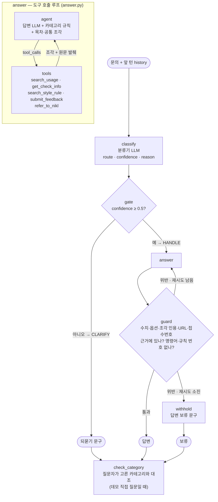

# REPORT — 자막 생성기 소통 창구 에이전트

- 과제: 모두의연구소 「에이전트 팀 꾸리기_Agt1」 5강 [실습 프로젝트] 라우팅 에이전트 만들기
- 저장소: https://github.com/tigermorning/subtitle-help-agent
- 작성: 2026-09-17
- 기록 원본: 기획 `PRD.md` · 매핑표 `docs/MAPPING.md` · 데이터 `data/README.md` · 실험 `runs/LAB.md` · 실행 로그 `runs/*.log`·`*.json`

---

## 1. 주제와 근거 문서

### 무엇을 골랐나

- 내가 만들고 있는 **자막 및 TC 생성기**(`subtitle-tc-generator`) 사용자의 **문의·건의 창구**
- 사용자는 자막 번역·SDH·TC 작업자
- 문의 한 줄 → 카테고리 판정 → 카테고리별 근거만 조립 → 근거로만 답변 → 검증
- 근거에 없으면 지어내지 않고 넘긴다
  - 한국어 어문 규범 질문 → 국립국어원 안내
  - 건의·버그 → 로컬 접수 기록

### 왜 골랐나

| 과제 조건 | 이 주제에서 |
|---|---|
| 카테고리마다 답하는 내용이 다르다 | 사용법 / 검사 결과 / 자막 규정 / 건의 / 범위 밖 — 처리 방식(조회·기록·넘기기)부터 다르다 |
| 카테고리별로 나눌 만큼 긴 문서 | 넷플릭스 공개 자막 문서 22건 + 생성기 사용법 + 검사 항목 설명 → 조각 129개 |
| 문서 없이 그럴듯하게 답할 수 있는 질문 | 자막 규정은 **그럴듯한 오답**이 많다 — 아래 |

- 그럴듯한 오답의 실제 예
  - 번역 자막과 SDH의 읽기 속도가 다르다(성인 12자 vs 14자). 문서를 안 읽으면 한 숫자로 답한다
  - 넷플릭스 "프레임 간격 규정은 2020년에 삭제됐다"는 오해 — 실제로는 타이밍 가이드로 **옮겨졌다**. 이 오해는 생성기 저장소 문서에도 적혀 있었고, 근거 문서를 모으다 발견해 고쳤다
  - 한국어 줄당 글자 수 23자(자동 QC 반려선)를 작업 기준으로 안내 — 실무 기준은 16자(사용자 확인)
  - 맞춤법 질문에 "보통은 ~가 맞습니다"로 답하기

### 근거 문서 — 공개 가능한 것만

| 문서 | 카테고리 | 조각 | 출처 |
|---|---|---|---|
| `docs/10_usage.md` | 사용법 | 17 | 생성기 데스크톱 앱·SE 플러그인 화면 문구 (메뉴·단추를 코드와 대조) |
| `docs/20_qc_checks.md` | 검사 결과 설명 | 34 | 생성기 넷플릭스 프로파일 규칙 번호 + 검사 구현 목록 |
| `docs/30_style_netflix.md` | 자막 규정 | 50 | 넷플릭스 한국어·공통·타이밍 가이드 3건 요약 |
| `docs/31_netflix_related.md` | 자막 규정 | 19 | 넷플릭스 FAQ·템플릿·부가/마케팅 영상·현지화 모범 사례 19건 요약 |
| `docs/40_feedback.md` | 건의·버그 | 5 | 창구 접수 방침 |
| `docs/50_referral_nikl.md` | 범위 밖 | 5 | 국립국어원 서비스 안내(주소 접속 확인) |

- 넷플릭스 원문은 파트너헬프 공개 API로 받아 **로컬 근거로만** 쓴다(`sources/fetch_netflix.py`, 저장소 제외)
  - 도구가 요약 조각과 함께 원문의 해당 절 발췌를 돌려준다(`originals.py`)
- **넣지 않은 것**: 생성기의 비공개 규정 저장소, 작업자 실무 자료, 디즈니+·쿠팡플레이 규정
  - 창구 답변이 외부 LLM API를 거치고 저장소가 공개라서다
- 문서별 원문 개정일·수집 중 발견한 것: `docs/SOURCES.md`

---

## 2. 카테고리 설계

### 카테고리와 나눈 근거

| 카테고리 | 정의 | 처리 방식 | 기대 도구 |
|---|---|---|---|
| `USAGE` 사용법 | 생성기를 **어떻게 쓰는가** — 데스크톱 앱·SE 플러그인의 메뉴·단추, 검사 결과 보기, 저장·결과 파일 | 문서 조회 | `search_usage` |
| `QC_EXPLAIN` 검사 결과 설명 | 검사 리포트에 뜬 **특정 경고**(예: 읽기 속도 초과)의 뜻·근거·고치는 법 | 문서 조회 | `get_check_info` |
| `STYLE_RULE` 자막 규정 | 자막을 **어떻게 써야 하는가** — 넷플릭스 규정 자체 | 문서 조회 | `search_style_rule` |
| `FEEDBACK` 건의·버그 | 기능 요청, 버그·오탐 제보 | 기록 | `submit_feedback` |
| `OUT_OF_SCOPE` 범위 밖 | 근거 문서로 답할 수 없는 질문 | 넘기기 | `refer_to_nikl` 또는 없음 |

- 나눈 기준 ① **처리 방식**(조회·기록·넘기기)이 다르다
- 나눈 기준 ② 조회 3종은 **질문의 대상**이 다르고 근거 문서가 겹치지 않는다
  - 도구의 동작 → 사용법 / 도구가 낸 결과 → 검사 결과 / 자막 작성 규칙 → 규정
- 어디에도 속하지 않는 것: `OUT_OF_SCOPE` — 두 갈래로 나눈다
  - 어문 규범: 넷플릭스 한국어 가이드 I.21이 "가이드에 없는 언어 문제는 국립국어원을 참고하라"고 직접 지시한다
  - 그 밖(작업료·다른 발주처 규정·비공개 자료·번역 요청·무관한 프로그램): 도구 없이 범위 밖 안내

### 카테고리 ↔ 근거 매핑표

| 카테고리 | 근거 조각 | 문서 | 프롬프트에 넣는 것 |
|---|---|---|---|
| `USAGE` | `U-01`~`U-17` | `10_usage.md` | 목차(ID·제목)만 — 본문은 도구로 조회 |
| `QC_EXPLAIN` | `Q-00`, `Q-01`~`Q-33` + 항목이 인용한 조항 | `20_qc_checks.md` (+ `30`) | 목차만 |
| `STYLE_RULE` | `KO-*` 32 + `GR-*` 10 + `TM-*` 8 + `NR-*` 19 | `30`·`31` | 목차만 |
| `FEEDBACK` | `F-01`~`F-05` | `40_feedback.md` | 본문 전부(조각이 적고 판단 기준이라) |
| `OUT_OF_SCOPE` | `R-01`~`R-05` | `50_referral_nikl.md` | 본문 전부 |
| 모든 카테고리 공통 | `F-04`(대본 붙여넣기 금지), `R-04`·`R-05`(범위 밖 기준) | — | 본문 |

- **카테고리마다 서로 다른 근거만 프롬프트에 들어간다** — `context.py`의 `ROUTE_DOCS`
- 본문 대신 목차를 넣은 이유: "필요한 근거를 읽었는가"가 **도구 호출로 드러나 측정**된다. 관련 없는 조항이 답을 끌고 가는 일도 줄인다
- `get_check_info`는 검사 항목 조각과 그 항목이 인용한 규정 조항을 **함께** 돌려준다 → 검사 결과 문의의 기대 도구는 하나

### 경계 판정 규칙 (요약 — 전체는 `docs/MAPPING.md` 3절)

| 경계 | 판정 |
|---|---|
| "미구현 검사 표시가 뭐냐" vs "읽기 속도 초과 경고가 떴는데" | 형식 질문은 사용법, 특정 항목은 검사 결과 |
| 검사 결과를 들고 옴 vs 규정만 물음 | 검사 결과 / 자막 규정 |
| 말줄임표 문자 vs '돼요/되요' | 가이드에 조항 있으면 규정, 없으면 범위 밖(국립국어원) |
| 특정 번호가 미구현이라고 나옴 | 검사 결과 (실험 07에서 추가) |
| 짜증·불만 표현만 섞임 | 원래 카테고리 — 요청·오류·오탐 제보일 때만 건의 (실험 07) |
| 다른 발주처·프로그램 이름이 나오지만 생성기 기능을 물음 | 사용법 (실험 07) |
| 증상 + 해결 방법을 물음 | 사용법 — 고장을 알리거나 "원래 이래요?"만 건의 (실험 10, 사용자 결정) |

---

## 3. 평가셋 설계

### 모두 합성, 정답은 근거 문서로만

| 파일 | 건수 | 쓰는 곳 |
|---|---|---|
| `data/goldenset.json` | 57 (eval 46 · fewshot 11) | 1턴 — 분류 + 도구 호출 + 답변 |
| `data/inquiries.csv` + `routing_answers.csv` | 150 (카테고리당 30, eval 120 · fewshot 30) | 분류 |
| `data/hard_cases.csv` | 72 (6유형 × 12 안팎) | 되묻기/처리 판단 |
| `data/answer_goldenset_multiturn.json` | 대화 12 (턴 24) | 여러 턴 |
| `data/faq.json` | 79 | 데모의 준비된 Q&A(평가용 아님) |

### 문항마다 적은 것 (`goldenset.json`)

- `route` 기대 카테고리 · `expected_tools` 기대 도구 집합(빈 목록 = 도구를 부르면 안 됨)
- `must` 반드시 담을 **사실** · `forbid` 문서를 안 읽으면 나오기 쉬운 **그럴듯한 오답**
- `refs` 근거 조각 · `gold_answer` 모범 답안(채점기 검증용)
- 넘기기가 정답인 문항 포함 — 국립국어원 안내 5, 도구 없는 범위 밖 5
- 예: "SDH 검사에서 읽기 속도 초과가 떴는데 기준이?" → `must` "SDH 성인 초당 최대 14자" / `forbid` "성인 기준이 12자라고 말한다"

### 기대 도구·필수 사실을 정한 근거

- 기대 도구: 매핑표 2절 — 카테고리의 조회 도구 하나. "기능 있나요? 없으면 만들어 주세요"처럼 확인+접수면 두 개
- 필수 사실·금지 표현: 각 문항 `refs` 조각의 문장에서만 뽑았다
- 질문 표현: Subtitle Edit GitHub 이슈와 한국어 커뮤니티 질문 게시판에서 **유형·말투만** 참고해 새로 썼다(원문 복제 없음). 참고한 이슈는 직접 열어 확인했다

### 평가용과 예시용을 가른 방법

- `split: fewshot / eval` — fewshot만 분류 지침 예시로 쓴다. eval 문항은 프롬프트에 **한 건도 넣지 않는다**
- 분류 150건은 카테고리마다 6건을 씨앗 고정 무작위로 fewshot으로 뽑았다(`scripts/build_routing_data.py`)
- 예시를 늘릴 때(실험 08) 예시 41건이 모든 평가 문항과 문장이 겹치지 않는지 확인했다

### 데이터 자체를 검증한 방법

| 검증 | 방법 | 결과 |
|---|---|---|
| 1턴 57건 사실 | 별도 검토 에이전트가 근거 문서·넷플릭스 원문과 대조 | 문제 2건 → 고침 |
| 분류 라벨 150건 | **정답을 가린 채** 다른 에이전트가 매핑표만 보고 다시 분류 | 150/150 일치. 해석이 갈릴 수 있는 15건은 문항 번호를 기록 |
| 어려운 문항 72건 | 검토 에이전트가 매핑표·게이트 동작과 대조 | 17행 지적 → 15행 반영 |
| 채점기 | 모범 답안은 전부 통과, 빈 답변은 전부 탈락해야 한다 | 아래 4절 |

---

## 4. 측정 결과

### 채점기 자체 검증 — 점수를 믿기 전에

| 검증 | 1차 | 고친 뒤 |
|---|---|---|
| 모범 답안을 채점기에 넣으면 통과해야 한다 | 49/51 | **57/57**, 여러 턴 **24/24** |
| 빈 답변("확인해 보겠습니다")은 떨어져야 한다 | 3/51 통과(너무 후함) | **0/57**, 여러 턴 **0/24** |
| 검증기(출처 검사)가 모범 답안을 위반으로 잡으면 안 된다 | 1/51 위반 | 0/57 |

- 1차에서 고친 것
  - 채점기가 `must` 항목 하나를 판정 목록에서 **빠뜨렸는데 통과로 셌다** → 항목 번호로 판정받고, 빠지면 다시 묻고, 그래도 빠지면 누락으로 센다
  - 빈 답변을 "접수했다"로 봐줬다 → 행동 항목은 명시적 문장이 있어야 인정
  - 검증기가 잡은 1건은 **모범 답안이 틀렸다**(근거 조각에 없는 옵션을 언급) → 모범 답안을 고쳤다

### 최종 수치 (실험 10, 같은 설정 두 번)

| 지표 | 1회차 | 2회차 |
|---|---|---|
| **도구 호출 적절성** (1턴 eval 46) | 44/46 (95.7%) | 45/46 (97.8%) |
| **답변 적절성** (1턴 eval 46) | 44/46 (95.7%) | 45/46 (97.8%) |
| forbid 위반 | 0 | 0 |
| 분류 정확도 · macro F1 (분류 eval 120) | 0.967 · 0.967 | 0.975 · 0.975 |
| 분류 정확도 · macro F1 (1턴 eval 46) | 0.913 · 0.906 | 0.957 · 0.955 |
| 어려운 문항 통과 (72) | 60 | 61 |
| 여러 턴 대화 통과 (12) · 도구 집합 일치 | 10 · 12 | 11 · 12 |
| 질문자가 틀리게 고른 카테고리를 바로잡음 (120, 실험 11) | 116 | 115 |

- 분류 120 혼동 행렬 (1회차, 행=정답 · 열=예측)

| | USAGE | QC_EXPLAIN | STYLE_RULE | FEEDBACK | OUT_OF_SCOPE |
|---|---|---|---|---|---|
| USAGE | **21** | 0 | 0 | 3 | 0 |
| QC_EXPLAIN | 0 | **24** | 0 | 0 | 0 |
| STYLE_RULE | 0 | 0 | **24** | 0 | 0 |
| FEEDBACK | 1 | 0 | 0 | **23** | 0 |
| OUT_OF_SCOPE | 0 | 0 | 0 | 0 | **24** |

- 카테고리별 F1: USAGE 0.913 · QC_EXPLAIN 1.000 · STYLE_RULE 1.000 · FEEDBACK 0.920 · OUT_OF_SCOPE 1.000
- 남은 혼동은 **사용법 ↔ 건의** 한 곳에 몰려 있다
- 주의
  - 실험 10 뒤에 근거 문서 두 곳(화면 글자 위치 충돌·화자 표시 일관성 설명)과 준비된 Q&A를 고쳤다. **그 뒤로는 API 사용 제한(사용자 결정) 때문에 다시 재지 않았다** — 위 수치는 실험 10 시점이다
  - 분류 120의 예시 30건과 평가 120건은 같은 저작 과정에서 나왔다. 문장은 겹치지 않지만 말투가 비슷해 점수에 그 이득이 섞였을 수 있다. 출처가 다른 1턴 46건에서도 분류 정답이 늘어 전부 그 효과는 아니다

### 틀린 건의 원인 분류

| 원인 | 대표 문항 | 어디서 틀렸나 | 상태 |
|---|---|---|---|
| 넘기기 전에 규정을 한 번 더 검색 | O-001~O-004 | 근거 문서(R-01)와 평가셋 기대 도구가 어긋남 | 02에서 해소(사용자 결정) |
| 새 문서 범위가 분류 지침에 없음 | S-016 피벗 템플릿 | 검색 범위만 넓히고 분류 정의는 안 고침 | 05에서 해소 |
| 미구현 항목 번호 → 사용법으로 | 400032·400043·400054 | 매핑표에 규칙 없음 | 07에서 해소 |
| 다른 이름에 끌려 범위 밖으로 | 400027 SubtitleEdit 북마크, F-004 쿠팡 프로파일 | 매핑표에 규칙 없음 | 07에서 해소 |
| 불만 섞인 사용법 질문 → 건의로 | 400002·400018·400024·400030 | 규칙으로 일부, 예시로 대부분 | 07·08에서 대부분 해소 |
| 접수 안 하고 재현 정보만 물음 | F-002·F-007·F-008, 여러 턴 M-03·M-08 | 답변 단계 규칙 | 09·10에서 해소 |
| 오분류가 안전망에 가려져 있었음 | U-004·U-006 | "접수 먼저"가 사용법 조회를 걷어 내자 드러남 | U-006은 10에서 해소, **U-004 남음** |
| **분류기가 문서를 못 봐 원인을 못 가림** | U-004(효과음 지적이 안 나옴 = `-k sdh` 누락) ↔ 400105(한글 경로에서 exe가 꺼짐 = 문서에 없는 증상) | 같은 "증상 문의" 표현인데 정답이 반대 | **구조적 한계로 남김** |
| 두 요청이 섞이면 확신도 미달 | 어려운 문항 다중의도 | 게이트가 되묻기로 보냄 | 남음 (12건 중 7·8건 통과) |
| 여러 턴에서 앞 턴 맥락이 검색어에 안 들어감 | M-10 "그럼 넷플릭스 SDH는요?" | 검색 | 남음 |

- 실패는 점수만 세지 않고 로그의 답변 원문을 읽어 분류했다(`runs/*.log`, 실험마다 `runs/LAB.md`에 기록)

### 개선 시도별 기록표

- 한 번에 하나씩 바꾸고 **같은 설정을 두 번** 쟀다(02부터). 1건 차이는 흔들림으로 봤다

| # | 바꾼 것 | 1턴 둘 다 통과 | 분류 120 정확도 | 어려운 72 | 여러 턴 12 | 판정 |
|---|---|---|---|---|---|---|
| 01 | 기준선 | 32/41 | — | — | — | — |
| 02 | 근거 문서 R-01: 넘기기 전 재검색 안 함(사용자 결정) | 35 · 37 /41 | — | — | — | 유지 |
| 03 | 넷플릭스 공개 문서 19건 추가 + 원문 발췌를 근거로 | 36 · 36 /41 | — | — | — | 유지(효과 측정 불가 → 04) |
| 04 | 평가셋에 새 문서용 6건 추가 | 39 · 40 /46 | — | — | — | 데이터 변경 |
| 05 | 분류 지침 STYLE_RULE 정의를 매핑표에 맞춤 | 43 · 41 /46 | — | — | — | 유지 |
| 06 | 평가 데이터 확장(분류 150·어려운 72·여러 턴 12) + 대화 맥락 | — | 0.925 · 0.917 | 62 · 60 | 10 · 10 | 기준선 |
| 07 | 경계 규칙 3개 추가 | 41 · 42 | **0.967 · 0.967** | 60 · 58 | 9 · 8 | 유지 |
| 08 | 분류 예시 30건 추가 | 42 · 42 | **0.992 · 0.975** | 61 · 58 | 11 · 10 | 유지 |
| 09 | 건의 답변 "접수 먼저" | 42 · 42 | — | — | **11 · 11** | 보류 → 10 |
| 10 | 증상+해결 방법 질문은 사용법(사용자 결정) | **44 · 45** | 0.967 · 0.975 | 60 · 61 | 10 · 11 | 유지 |
| 11 | 질문자가 고른 카테고리 검증(데모) | — | 바로잡음 116 · 115 /120 | — | — | 유지 |

- 되돌린 시도는 없다 — 대신 **판정을 보류하고 원인을 먼저 가린** 경우가 있다(09: 새로 깨진 두 문항이 오분류가 드러난 것인지 확인)

---

## 5. 파이프라인 구조도

### 전체 그래프 (`agent.py`, LangGraph)

### 상태(State)

| 키 | 채우는 노드 | 내용 |
|---|---|---|
| `question`, `history` | 입력 | 이번 문의, 앞 턴들(대화 상태는 부르는 쪽이 들고 있다) |
| `route`, `confidence`, `reason` | classify | 카테고리 판정 |
| `action`, `message` | gate / guard / withhold | `HANDLE` `CLARIFY` `ANSWER` `RETRY` `WITHHOLD`, 되묻기 문구 |
| `answer`, `calls`, `chunks`, `prompt_chunks` | answer | 답변, 도구 이름·인자, 조회한 조각(원문 발췌 포함), 프롬프트에 넣은 조각 ID |
| `check`, `attempts`, `first_answer` | guard / answer | 검증 결과, 생성 횟수, 재생성 전 첫 답변 |
| `category_check` | `help_desk` 후처리 | 고른 카테고리 · 분류기 판단 · match/mismatch/unclear |

### 설계 요점

- **카테고리 판정(classify)과 넘길지 판단(gate)을 다른 노드로** — 임계값만 바꿀 때 모델을 다시 부르지 않고, 둘을 따로 잰다
- **질문자가 고른 카테고리는 분류기에 넘기지 않는다** — 넘기면 분류기가 따라가 검증이 안 된다. 결과와 대조만 한다
- **검증은 기계적으로** — 답변 속 수치·옵션 이름·조각 인용·URL·접수번호가 조회한 조각(원문 발췌 포함)에 있는지, 명령어·규칙 번호를 쓰지 않았는지. 서술의 뜻은 못 본다 → 채점기가 본다

---

## 6. 데모 설계

- 실행: `streamlit run app.py`

### 화면 흐름

1. **사이드바에는 카테고리만** — 누르면 그 카테고리의 준비된 Q&A 목록(79건, 그룹별 펼침, 카테고리 안 검색)
2. Q&A에서 답을 못 찾으면 **[직접 질문하기]** — **카테고리를 먼저 골라야** 보낼 수 있다(안 고르면 막히고 쓴 질문은 남는다)
3. 보내기 전 **비슷한 준비된 Q&A가 있으면 먼저 보여 준다** — "이 답으로 해결됐어요" / "그래도 질문 보내기"
4. 보낸 질문은 **고른 카테고리를 믿지 않고** 분류기가 따로 판정해 대조한다
   - 같으면 `카테고리 확인됨`, 다르면 `카테고리 바로잡음` + "고르신 카테고리는 X지만 Y로 보고 답합니다", 확신이 없으면 되묻는다
5. 답변 아래 배지 한 줄 + 탭 4개
   - ① 분류·카테고리 검증(고른 것 / 판단 / 이유) ② 호출한 도구(이름·인자) ③ 근거(조각 본문 + 넷플릭스 원문 발췌) ④ 검증(통과·위반 내용·재생성했으면 첫 답변)

### 신경 쓴 부분

- **준비된 Q&A도 답변과 같은 잣대로 검증** — `python faq.py`가 답 속 수치·옵션·주소가 인용 조각에 있는지, 첫 근거가 그 카테고리 문서인지 본다(79/79). 뜻은 검토 에이전트가 문서와 대조해 중복 16건·서술 11건을 고쳤다
- **API를 쓰지 않는 시험으로 화면 흐름을 확인** — `tests/test_offline.py`가 모델 호출을 막고(막혔는지부터 확인) 가짜 응답으로 48개 시험
- **비공개 자료 경고** — 방송 전 대본을 붙여넣지 말라는 안내를 사이드바에 상시
- **좁은 화면** — 지표 칸이 잘려 한 줄 배지로 바꿨다
- 맞춤법 질문 예시는 데모에서 뺐다(사용자 판단)
- **규칙 번호를 사용자에게 보이지 않는다**(사용자 판단) — 생성기 리포트의 `S02` 같은 번호는 사용자가 모른다
  - 질문·답·평가 데이터 전부 검사 항목을 **내용**("SDH 읽기 속도 초과")으로 쓴다
  - `get_check_info`는 내용으로 찾고, 리포트 표시를 그대로 붙여 넣어도 찾는다
  - 검증기가 답변 속 규칙 번호·검사 이름을 "내부 표기 노출"로 잡는다
- **사용자는 코딩을 모른다**(사용자 판단) — 명령어·명령줄 옵션은 알 필요도 없고 알아서도 안 된다
  - 사용법 근거를 데스크톱 앱과 Subtitle Edit 플러그인의 메뉴·단추 이름으로 새로 썼다. 명령줄에만 있는 기능은 뺐다
  - 설치 문제는 [도움말 → 진단...]의 `[없음]` 줄을 제보하도록 안내한다
  - 검증기가 답변 속 명령(`python`·`pip`·`winget` 등)을 "명령어 노출"로 잡는다

### 화면 캡처

- 아직 넣지 않았다 — 직접 질문 화면은 실제 모델 호출이 필요해 사용자 승인 뒤 캡처한다

---

## 7. 프로젝트 회고

### 가장 공들인 부분

- **점수를 믿을 수 있게 만드는 일**
  - 채점기를 모범 답안(전부 통과)과 빈 답변(전부 탈락) **양방향**으로 검증했다. 1차에 둘 다 틀렸다
  - 분류 라벨을 **정답을 가린 재분류**로 검증했다(150/150)
  - 같은 설정을 **두 번** 재서 흔들림(1턴 기준 1~2건)을 알고 판정했다
- **근거 문서의 정확성**
  - 넷플릭스 원문 22건을 끝까지 읽고 요약했고, 원문 발췌를 근거로 함께 돌려준다
  - 모으는 과정에서 생성기 저장소의 틀린 기록(프레임 간격 규정 "삭제")과 규정 파일 버그(서로 다른 두 검사가 같은 규칙 번호 `S17`)를 찾아 각각 고쳤다
- **실패를 점수가 아니라 원문으로 읽기** — 09에서 점수는 제자리였지만, 고쳐진 것과 새로 깨진 것을 나눠 보니 "오분류가 안전망에 가려져 있었다"는 구조가 드러났다

### 배운 것

- 모두몰 실습과 같은 결론이 다시 나왔다 — **점수를 올린 변경은 대부분 "문서와 지시가 어긋난 곳을 맞춘 것"**이었다(02 R-01, 05 분류 정의, 07 매핑표 규칙)
- 평가셋과 근거 문서가 서로 다른 말을 하면 모델 탓이 아니다 — 먼저 어느 쪽이 맞는지 사용자에게 물었다(02, 10)
- 넓게 받아 주는 규칙(건의 답변이 사용법부터 조회)은 오분류를 **가린다**. 안전망을 걷을 때 무엇이 드러나는지 봐야 한다

### 보완하고 싶은 것

| 한계 | 보완 방향 |
|---|---|
| 분류기가 문서를 못 봐 "문서로 설명되는 증상인가"를 못 가린다(U-004 ↔ 400105) | 건의로 분류돼도 답변 단계에서 증상을 사용법 문서와 대조하고, 설명되면 안내만 — "접수 먼저"와의 우선순위 설계가 필요 |
| 두 요청이 섞인 문의가 되묻기로 빠진다 | 요청마다 카테고리가 분명하면 확신도를 낮추지 않고, 답변 단계에서 두 카테고리의 도구를 쓰게 |
| 여러 턴에서 앞 턴 맥락이 검색어에 안 들어간다(M-10) | 검색어를 만들 때 앞 턴 주제를 합치기 |
| 검증기는 서술의 뜻을 못 본다 | 채점기와 같은 방식의 사실 검증을 답변 경로에 붙일지 비용과 함께 판단 |
| 실험 10 뒤 근거 문서·Q&A 수정분은 재측정 안 함(API 사용 제한) | 승인받아 1턴·여러 턴을 다시 재기 |
| 건의·범위 밖 준비된 Q&A가 적다(7·11건) | 기존과 겹치지 않는 질문으로 보강 |
| 평가 데이터가 한 저작 과정에서 나와 말투가 비슷하다 | 실제 사용자 문의가 쌓이면 그것으로 다시 재기 |
